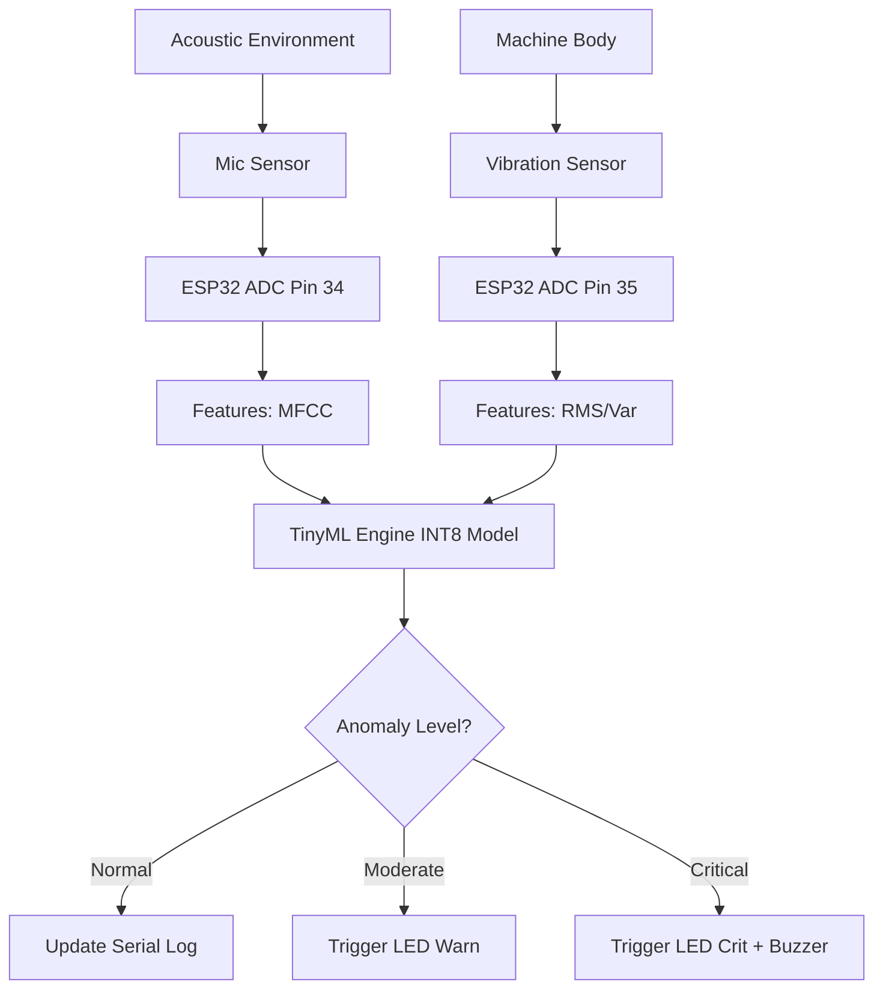

# TinyML Acoustics and Vibration Signature System Architecture

## Overview
This document outlines the multi-agent design of the TinyML system running on edge devices.

## Core Modules

1. **Hardware Agent (Sensors & Analog Front End)**
   - **Sound Capture**: Converts acoustic pressure to analog voltage. Preamplifier scaling logic ensures input fits the 3.3V ADC range of the ESP32.
   - **Vibration Capture**: Piezoelectric/accelerometer input filtered through a low-pass filter to remove 60Hz hum, creating an analog DC signal proportional to vibration amplitude.

2. **Signal Processing Agent**
   - Implemented natively via `signal_processing.py`.
   - Generates MFCC (Mel-frequency cepstral coefficients) to simplify the frequency domain.
   - Generates RMS and Variance for time-domain vibration insights.

3. **TinyML Model Agent**
   - A sequential dense neural network (16 hidden -> 8 hidden -> 3 output nodes).
   - Optimized Post-Training Quantization (PTQ) to INT8 format reduces memory footprint (Flash/SRAM usage).
   - Produces C-array `model_data.h`.

4. **Embedded Systems Agent**
   - Reads inputs using `analogRead()` mapped to physical pins.
   - Pushes processed arrays to TFLiteMicro Interpreter buffer.
   - Fetches Output tensor and translates to logic levels (`HIGH`/`LOW`) on Warn/Critical LEDs and Buzzer signals.

## Block Diagram

