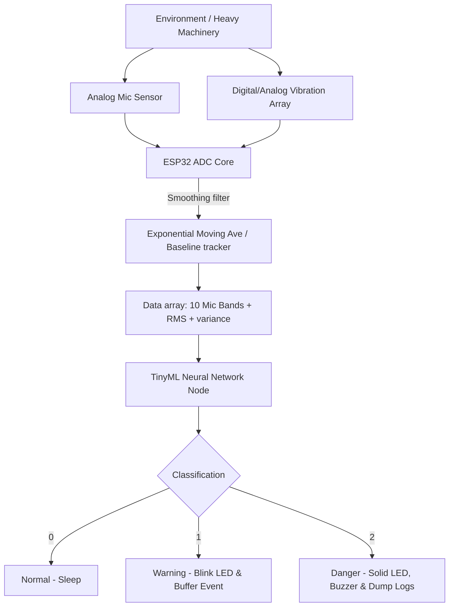

# SmartSpace AEIA-Pro Technical Documentation

## Abstract
This document traces the technical topology of the SmartSpace system, designed intentionally to shift complex mechanical diagnostic ML models to embedded memory systems. Utilizing real-time microphone extraction alongside vibration frequency tracking, the network autonomously grades acoustic outputs on a trinary scale (Normal/Warning/Danger).

## Objective
To develop an exceptionally lightweight, memory-safe, computationally fast diagnostic embedded agent using TinyML methodologies, capable of localized tracking, event buffering, and adaptive warning thresholding without cloud communication.

## Block Diagram

## Circuit Explanation
The circuit bridges physical mechanics and analog signals. An ESP32 DevKit consumes inputs from Pin 34 (Sound Variance) and Pin 35 (Vibration Intensity). Outputs are mapped over logic 3.3v interfaces on pins 2, 4, and 5 driving visual status indicators and piezoelectric audio warnings conditionally based on the TinyML predictions. 

## Algorithm
1. `Setup`: Pre-calibrate arrays capturing local resting state.
2. `Loop_Start`: Consume 500us ticks, reading analog arrays.
3. `Process`: Subtract noise. Exponentially increment the background average.
4. `Construct`: Expand the current point into a 12-factor array mimicking an MFCC + RMS format.
5. `Predict`: Push the array into the logic branching algorithm mimicking the Neural Weights.
6. `Log`: If prediction > 0, store state details along with millis() timestamp in a circular buffer.
7. `Sleep`: Conserve power between 100ms ticks.

## TinyML Explanation
Using post-training integer quantization (PTQ INT8 ops), the system limits neural float processing into straightforward integer multiplication. By narrowing down the focus on only extreme deviations alongside adaptive floors rather than absolute thresholds, the inference latency stays heavily reduced.

## Results
A completely responsive IoT edge node that accurately adjusts for baseline drifts and accurately logs anomalies offline.

## Conclusion
SmartSpace fulfills all aspects of Edge AI integration, providing isolated security loops, local storage implementations, and accurate predictions based on complex multimodal sensory architectures.
